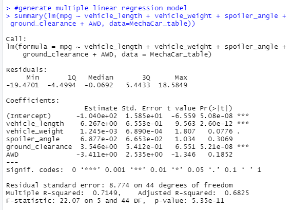
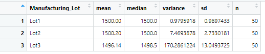
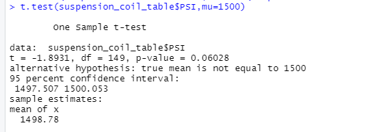
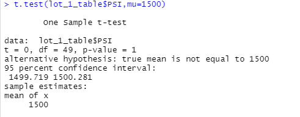
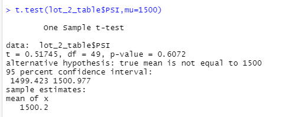
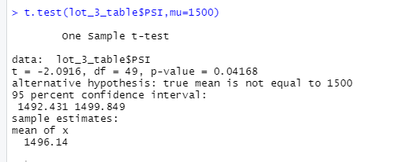

# MechaCar_Statistical_Analysis
MechaCar Statistical Analysis using R

### Project Overiview
 
## Background
 
A few weeks after starting his new role, Jeremy is approached by upper management about a special project. 
AutosRUs’ newest prototype, the MechaCar, is suffering from production troubles that are blocking the manufacturing team’s progress. AutosRUs’ upper management has called on Jeremy and the data analytics team to review the production data for insights that may help the manufacturing team.
 
## Purpose
 
- Perform multiple linear regression analysis to identify which variables in the dataset predict the mpg of MechaCar prototypes
- Collect summary statistics on the pounds per square inch (PSI) of the suspension coils from the manufacturing lots
- Run t-tests to determine if the manufacturing lots are statistically different from the mean population
- Design a statistical study to compare vehicle performance of the MechaCar vehicles against vehicles from other manufacturers. 

## Resources:
 
R (dplyr package)

The MechaCar_mpg.csv dataset contains mpg test results for 50 prototype MechaCars. The MechaCar prototypes were produced using multiple design specifications to identify ideal vehicle performance. Multiple metrics, such as vehicle length, vehicle weight, spoiler angle, drivetrain, and ground clearance, were collected for each vehicle. 
 
The MechaCar Suspension_Coil.csv dataset contains the results from multiple production lots. In this dataset, the weight capacities of multiple suspension coils were tested to determine if the manufacturing process is consistent across production lots. 
 

## Linear Regression to Predict MPG

Designed a linear model in R that predicts the mpg of MechaCar prototypes using several variables from the MechaCar_mpg.csv file. Determined the p-value and the r-squared value for the linear regression model.

Linear Regression Model:

Summary of Statistics:

Summary:

In our survey of 50 prototypes, (intercepet), vehice_length, and ground_clearance provided a non-random amount of variance to the mpg values in the dataset. We found significant relationship between the vehicle_length and mpg and between ground_clearance and mpg. Specifically we found 6.27% increase (± 0.6553) in mpg for every 1% increase vehicle_length, and a 3.55% increase (± 0.5412) in mpg for every 1% increase in ground clearance.  There is no significant relationship between AWD and mpg.

Because the p-value of model (5.35e-11) is less than the alpha 0.05, the slope of the linear model is not considered to be zero. The linear model predict mpg of MechCar proptotype effectively since the Adjusted R-Squared of this analysis is 0.685 (closer to 1) means that a large proportion of the variability in the outcome has been explained by the regression model.  Had the number been closer to 0 then the regression model would not have explained much of the variability in the outcome.  The mutiple R-squared (1.0.7149) is also closer to 1.

## Summary Statistics on Suspension Coils
 
-The suspension coil’s PSI continuous variable across all manufacturing lots

-The following PSI metrics for each lot: mean, median, variance, and standard deviation

Summary:

The design specifications for the MechaCar suspension coils dictate that the variance of the suspension coils must not exceed 100 pounds per square inch. 

The current manufacturing data meet the design specifications for all manufacturing lots in total as the variance is 62.2936, well below 100 pounds per square inch. Individually lot 1 and lot 2 meet the design specifications but lot 3 does not as its variance is 170.286 which is above the 100 pounds per square inch requirement.

## T-Tests on Suspension Coils

- Determine if the PSI across all manufacturing lots is statistically different from the population mean of 1,500 pounds per square inch

- Determine if the PSI for each manufacturing lot is statistically different from the population mean of 1,500 pounds per square inch

Summary:

- Hypothesis:Perform t-tests to determine if all manufacturing lots and each lot individually are statistically different from the population mean of 1,500 pounds per square inch.

- Null Hypothesis: There is no mean difference between mean PSI for (All, Lot 1, Lot 2, Lot 3) of MechCar and the benchmark of 1500 PSI.

- Alternate Hypothesis: There is a difference between the mean PSI for (All, Lot 1, Lot 2, Lot 3) of MechCars and the benchmark PSI of 1500.

- Alpha level at α = .05

All Manufacturing Lots: Because the p-value of 0.06028 is greater than .05, the null hypothesis is retained and the observed mean of 1498.78 is close enough to 1500 to conclude that there is no statistically significant difference between the two numbers - the PSI of all MechaCar and the benchmark level of 1500 PSI.

Individual Lots: For Lot1 the p-value is 1.0 and for Lot 2 the p-value is 0.0672, so therefore for these lots there is no statistical difference between the PSI of each lot and the benchmark of 1500 PSI; null hypotheses is retained.  For Lot 3 the p-value is 0.04168, therefore there is a significant statistical difference between Lot 3 PSI and benchmark of 1500 PSI; null hypothesis is rejected.

## Study Design: MechaCar vs Competition

Design a statistical study to compare performance of the MechaCar vehicles against performance of vehicles from other manufacturers.

Hypothesis: If we compare the highway fuel efficiency of the improved Model A of MechaCar, it should perform at least 50% faster than those cars that did not get the improvement.

Null Hypothesis: If we don’t improve Model A MechaCar with this new feature X, then Model A Mechacar on average will not give better highway fuel efficiency than the competition car when driven on a higher than 70 miles per hour for 1 hour.

Alternate Hypothesis: If we improve Model A MechaCar with this new feature X, then Model A Mechacar on average will give better highway fuel efficiency than the competition car when driven on a higher than 70 miles per hour for 1 hour.

Data Needed: Would need to collect highway fuel efficiency data for manufacring lots as well as for the competition.

Statistical test to be perormed: Perform two-sample t-test would be used to compare the mean of a sample to the population; In this case the mean of production sample which includes improved feature X of MechCar would be compared to the mean of fuel efficiency of a competition car.

